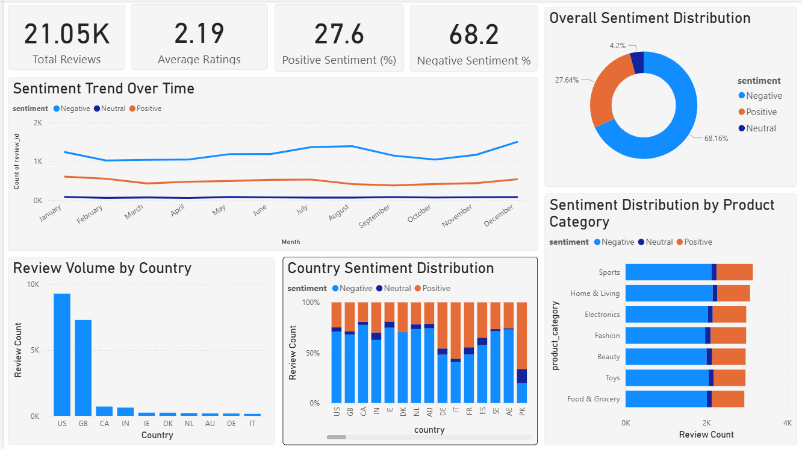
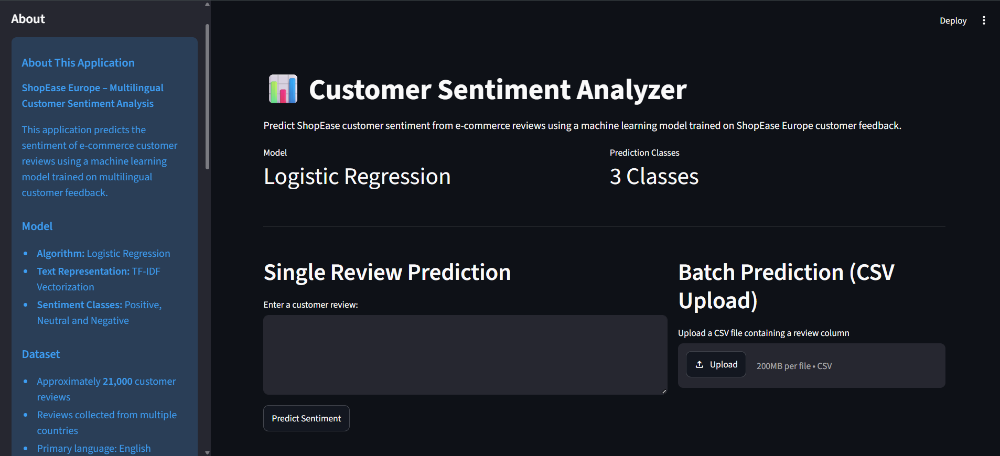

# ShopEase Europe Customer Review Sentiment Analysis

## Project Overview

This project analyses customer reviews from ShopEase Europe to understand customer sentiment, identify common customer concerns, and explore patterns in customer feedback across product categories and countries.

The project uses Natural Language Processing (NLP) and machine learning techniques to classify reviews as **Positive**, **Neutral**, or **Negative**. The analysis is supported by a Power BI dashboard and a Streamlit application for sentiment prediction.

The project demonstrates the end-to-end workflow of a sentiment analysis solution, from data preparation and exploratory analysis to model development, dashboard reporting, and deployment.

## Business Problem
ShopEase Europe receives a large volume of customer feedback across multiple products, countries, and languages. Analysing this feedback manually is time-consuming and difficult to scale.

A sentiment analysis solution can help the business:

- Monitor customer satisfaction levels
- Identify recurring customer complaints
- Understand customer perceptions of products and services
- Track sentiment trends over time
- Support product and service improvement initiatives


## Project Objectives

The objectives of this project were to:

- Prepare and clean multilingual customer review data
- Detect and analyse language distribution across reviews
- Preprocess review text for analysis
- Explore customer sentiment patterns and review behaviour
- Develop and compare sentiment classification models
- Create a stakeholder-facing Power BI dashboard
- Deploy a Streamlit application for sentiment prediction


## Dataset

The original dataset contains approximately **21055 customer reviews** collected across multiple countries and product categories.

To keep this repository lightweight, the dataset is not included.

To reproduce the analysis:

1. Place the dataset in the `data/` directory.
2. Update file paths where necessary.
3. Run the project scripts in the order outlined in the project workflow.


### Dataset Features

| Feature | Description |
|----------|------------|
| review_id | Unique review identifier |
| product_category | Product category reviewed |
| timestamp | Date the review was submitted |
| country | Customer country code |
| rating | Customer rating (1–5) |
| review | Customer review text |
| sentiment | Sentiment label (Positive, Neutral, Negative) |

### Languages Included

- English (en)
- Italian (it)
- Dutch (nl)
- French (fr)
- German (de)
- Spanish (es)
- Polish (pl)
- Danish (da)

## Project Workflow

### 1. Data Quality Assessment

- Data inspection
- Missing value analysis
- Duplicate detection
- Data type validation

### 2. Data Cleaning

- Duplicate removal
- Datetime conversion
- General data quality checks

### 3. Language Detection

Review languages were identified using 'ftlangdetect' and analysed to understand the language distribution within the dataset.

### 4. Text Preprocessing

The preprocessing pipeline included:

- Lowercasing
- URL removal
- Special character removal
- Tokenisation
- Stop-word removal
- Lemmatisation

### 5. Exploratory Data Analysis

The analysis explored:

- Sentiment distribution
- Rating patterns
- Product category performance
- Country-level review patterns
- Frequently occurring keywords and phrases

### 6. Sentiment Classification

Three sentiment classification models were developed and evaluated:

- Multinomial Naïve Bayes
- Logistic Regression
- DistilBERT

### 7. Dashboard Development

A Power BI dashboard was developed to provide an interactive view of customer sentiment and review patterns.

### 8. Application Development

A Streamlit application was created to allow users to predict sentiment from new customer reviews.


## Models Developed

### Baseline Models

- Multinomial Naïve Bayes
- Logistic Regression

### Transformer Model

- DistilBERT

Models were evaluated using:

- Accuracy
- Precision
- Recall
- F1-Score

The Logistic Regression model was selected for deployment due to its strong performance and efficient prediction time.

## Power BI Dashboard

A stakeholder-facing dashboard was developed to provide an interactive overview of customer sentiment and review patterns.

### Dashboard Features

#### Sentiment Overview

- Total Reviews
- Average Rating
- Positive Sentiment Percentage
- Negative Sentiment Percentage
- Sentiment Trends Over Time
- Overall Sentiment Distribution

#### Category Analysis

- Sentiment Distribution by Product Category

#### Country Analysis

- Review Volume by Country
- Sentiment Distribution by Country

### Dashboard Preview



### Key Findings

- Negative reviews accounted for the largest share of customer feedback.
- The average customer rating aligned closely with the sentiment analysis results.
- Customer sentiment patterns were relatively consistent across product categories.
- Review volume varied across countries, with some markets contributing substantially more feedback than others.

## Streamlit Application

The Streamlit application allows users to predict sentiment from individual reviews or uploaded datasets.

### Features

- Single review sentiment prediction
- Batch prediction using CSV uploads
- Sentiment distribution visualisation
- Downloadable prediction results

### Application Preview




## Technologies Used

### Programming and Analysis

- Python
- Pandas
- NumPy
- os
- ast

### Natural Language Processing

- spaCy
- ftlangdetect
- clean-text
- Hugging Face Datasets

### Machine Learning
- Scikit-learn
- PyTorch
- Hugging Face Transformers 
- Evaluate

### Data Visualisation
- Matplotlib
- Seaborn
- Power BI

### Deployment

- Streamlin
- Joblib


## Repository Structure
```text
ecommerce-sentiment-analysis/
│
├── data/
│   ├── unprocessed_reviews.csv 
│   ├── unprocessed_reviews.csv 
│   └── dashboard_dataset.csv
│
├── models/
│   ├── logistic_regression.pkl 
├── naive_bayes.pkl
│   └── tfidf_vectorizer
│   ├── distilbert_results/
│       └── distilbert_epoch2.pkl
│   
├── src/
│   ├── data_cleaning.py
│   ├── data_preprocessing_utils.py
│   ├── exploratory_data_analysis.py
│   ├── model_development.py
│   ├── sentiment_analysis.py
│   └── dashboard_metrics.py
│
├── images/
│   ├── powerbi_dashboard.png
│   └── streamlit_app.png
│
├── app.py
│ 
├── README.md
├── requirements.txt
└── .gitignore
```

## Installation

### Clone the Repository
```bash
git clone https://github.com/yourusername/ecommerce-sentiment-analysis.git
cd ecommerce-sentiment-analysis
```

### Install Dependencies

```bash
pip install -r requirements-dev.txt
```

### Install spaCy Language Models

After installing the project requirements, install the required spaCy language models:

```bash
python -m spacy download en_core_web_sm
python -m spacy download fr_core_news_sm
python -m spacy download de_core_news_sm
python -m spacy download es_core_news_sm
```

## Running the Streamlit Application

```bash
streamlit run app.py
```

## Future Improvement

- Fine-tune larger transformer models
- Explore topic modelling for customer complaints
- Add real-time sentiment monitoring
- Deploy the application to the cloud
- Automate dashboard refresh and reporting

## Author

**Susan Dangana**

Data Scientist | Machine Learning, NLP, Predictive Analytics, Data Visualisation and Business Intelligence